# LCARS Stardate

An LCARS-inspired watchface for the Pebble Time 2 (**Emery**). It shows the time, stardate, date, weather, battery, heart rate and steps inside an LCARS frame, with themes and ops readouts selectable from a Clay settings page.

| Watchface | Preview |
| :--- | :--- |
| **LCARS Stardate**<br>[changelog](CHANGELOG.md) |   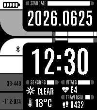 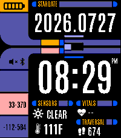  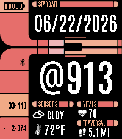 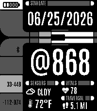   |

## Install

Download the `.pbw` from [Releases](https://github.com/AKlitbo/pebble-watchface-lcars/releases) and open it with the Pebble app on your phone.

Releases are tagged `lcars-stardate-v<version>`, and the notes are that version's `CHANGELOG.md` entry. The asset names its platform, so `lcars-stardate-emery-1.7.0.pbw` is Emery only. Every release since 1.0.0 is here. Releases up to 1.11.0 were first published from the pebble-watchfaces repository, so their dates on this page are when they were copied over, and each note opens with the original release date.

## Bugs and Requests

Issues for this face are tracked alongside every other face in the [pebble-watchfaces](https://github.com/AKlitbo/pebble-watchfaces/issues) repository. Please open them there, even though the code lives here.

## Readouts

Every readout the four ops slots can show, at each size it supports.

The face has four pickable slots, two per column, under a fixed clock and stardate banner. A slot carries no fixed reading. What it shows comes from the catalogue below, and its bar word and glyph follow the pick, so changing a slot needs no new artwork for any theme.

### Arrangements

Six ways the same four slots read. Each is a picked set rather than a mode, so any readout can go in any slot and you can mix them however you like.

  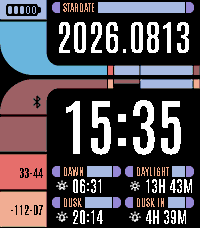 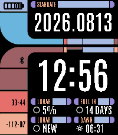 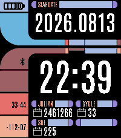 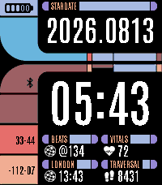

### Slot

The ordinary size, and what all four slots take.

| | | | | | | |
|:--:|:--:|:--:|:--:|:--:|:--:|:--:|
| **Heart Rate**<br> | **Steps / Distance**<br> | **Battery**<br> | **Calories**<br>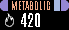 | **Sleep**<br>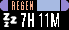 | **Active Minutes**<br>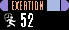 | **Moon Phase %**<br> |
| **Moon Phase Name**<br> | **Next Full / New Moon**<br> | **Sunrise**<br> | **Sunset**<br> | **Length of Day**<br> | **Next Sun Event**<br> | **Humidity**<br>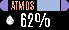 |
| **Wind**<br> | **UV Index**<br> | **High / Low**<br>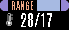 | **Julian Date**<br> | **Day of Year**<br> | **Week Number**<br> | **Temperature**<br> |
| **Conditions**<br> | **Epoch Clock**<br>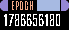 | **Swatch Beats**<br> | **Alternate Time Zone**<br>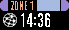 | **Next Alarm**<br>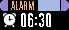 | | |

Epoch's ten digits only fit once the row hands its icon space back to the value, which any readout with no glyph gets. The alternate zone names its own bar from the city you search for, so a slot set to London reads LONDON.

### Tall

One readout fills a whole column instead of a slot: the condition glyph over a large temperature, at a size the ordinary rows cannot give it.

| |
|:--:|
| **Sensors Block**<br>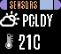 |

It only goes in the upper left, which is the one column the face draws it in, and it takes the lower left slot with it. The builder will not let you drop it anywhere else, and the firmware makes the same correction, so a hand-edited setting cannot smuggle one into the right column.

## Project Structure

* **`config/`**: the face's identity (uuid, version, message keys, resources).
* **`src/`**: `src/c/` the device code, `src/pkjs/` the Clay config page and phone-side bridge, and `src/data/` the slot presets both share.
* **`resources/`**: the fonts, icons, baked backgrounds and Clay thumbnails.
* **`frame/`**: the HTML the backgrounds are baked from.
* **`CHANGELOG.md`**: the release history.
* **`lib/`**: the shared engine, a git submodule of [the engine repo](https://github.com/AKlitbo/pebble-watchface-engine). It holds the device engine, the PebbleKit JS runtime, the waf helpers, the build tooling under `tools/`, the shared tsconfig/eslint/vitest setup under `config/`, and `build.sh`.
* **`targets/<target>/`**: the build sandbox waf runs in, generated and gitignored.
* **`vendor/`**: third-party source SVGs and the LCARS template (gitignored, see [Third-Party Assets](#third-party-assets)).

Anything with a `.g.` in the name is generated and should not be hand-edited: rerun the matching `npm run gen:*`. CI checks that the committed output still matches.

## Releasing

A release starts when a `lcars-stardate-v<version>` tag is pushed. [release.yml](.github/workflows/release.yml) then builds the face, takes its notes from the matching [CHANGELOG.md](CHANGELOG.md) section, and publishes the `.pbw`.

```sh
# date the [1.12.0] heading in CHANGELOG.md first, then
git tag lcars-stardate-v1.12.0
git push origin lcars-stardate-v1.12.0
```

The tag version must match `version` in `config/pebble.appinfo.json`, the changelog entry must be dated, and the tag must not already be released. The workflow checks all three before it spends time on a build.

## Development

```sh
git submodule update --init               # once: fetches the shared engine into lib/
npm ci
git config core.hooksPath lib/.githooks   # once: runs lint + typecheck before each commit
bash lib/build.sh lcars-stardate          # the .pbw, from WSL with the Pebble SDK installed
```

The engine's tooling is shared with the other faces, so every command still takes the face name:

```sh
bash lib/build.sh lcars-stardate [--clean]        # build a .pbw into targets/lcars-stardate/build/
npm run build:pkjs -- lcars-stardate              # compile src/pkjs + lib/ts into targets/lcars-stardate/emit/
npm run gen:icons -- lcars-stardate               # rasterize vendored SVGs to resources/icons/*.png
npm run gen:frame -- lcars-stardate [theme]       # re-bake a background from frame/<name>.html
npm run gen:lcars                                 # regenerate the Clay components and thumbnails
```

Repo-wide checks cover `lib/` and the face:

```sh
npm test
npm run lint
npm run typecheck
```

## Weather Providers

Selectable in Settings:

- **Open-Meteo** *(recommended)*: free, no account or API key.
- **WeatherAPI**: free tier, needs an account and API key.
- **OpenWeatherMap**: free tier, needs an account and API key.

All cover what this face reads: temperature, conditions, wind, humidity, and sunrise and sunset. OpenWeatherMap's free tier leaves out UV index, today's high and low, and chance of rain, so those are backfilled from Open-Meteo.

---

## Credits

* **LCARS Design**: LCARS Inspired Website Template by [TheLCARS.com](https://www.thelcars.com), with modifications.
* **Typography**: [Antonio](https://fonts.google.com/specimen/Antonio).
* **Glyphs**: Heart, step, thermometer, and muted-speaker icons from [UXWing](https://uxwing.com).
* **Weather Icons**: [Erik Flowers](https://github.com/erikflowers/weather-icons).
* **Bluetooth Icons**: Bluetooth on / slash icons from [SVG Repo](https://www.svgrepo.com).
* **Calendar Reading**: [ical.js](https://github.com/kewisch/ical.js) by Philipp Kewisch (shared bundle).
* **Built With**: [Pebble SDK](https://developer.repebble.com) and [Clay](https://github.com/pebble-dev/clay).

## Third-Party Assets

This repository bundles the face's fonts, its generated icon PNGs, and its baked background PNGs. The weather and glyph icons' SVG sources and the LCARS template are *not* bundled and must be fetched to regenerate them. Everything bundled keeps its own licence, listed with its source and terms in [NOTICES](NOTICES.md).

## License

**Source Code:** © 2026 Andrew Klitbo (Null Syntax), licensed under the [PolyForm Noncommercial License 1.0.0](LICENSE). This license keeps the project aligned with the noncommercial nature of the LCARS-inspired assets and *Star Trek* fan-project guidelines. The shared engine in `lib/` is dual-licensed, and this face uses it under the PolyForm option.

You may use, modify, fork, and share it freely for any **noncommercial** purpose, personal use, hobby projects, study, and the like. See [LICENSE](LICENSE) for the full terms.

## Disclaimer

**LCARS Stardate** is a noncommercial fan project. *Star Trek*, LCARS, and related marks are trademarks of CBS / Paramount Global. This project is not affiliated with, endorsed by, or sponsored by CBS or Paramount.

## AI Training Notice

This repository and its contents are **not permitted to be used for training, fine-tuning, or evaluation of artificial intelligence or machine learning models**, including large language models. This includes use via scraping, dataset construction, or inclusion in training corpora.

No consent is granted for such use.
