# LCARS Stardate

I made LCARS Stardate for my Pebble Time 2, so it runs on Emery only. It puts the time and the date inside an LCARS frame, with a battery gauge, Bluetooth and Quiet Time icons, and four panels you fill from the settings page with whatever readouts you like.

## Install

Grab the `.pbw` from [Releases](https://github.com/AKlitbo/pebble-watchface-lcars/releases) and open it with the Pebble app on your phone.

Each release's notes are its [changelog](CHANGELOG.md) entry, and the file name says which watch it's for, so `lcars-stardate-emery-1.13.0.pbw` is for Emery. Every version since 1.0.0 is there. I first published up to 1.11.0 from my pebble-watchfaces repository, so those show the date I copied them over here, and each note opens with the date it really came out.

## Themes

Pick one from Frame Theme in the settings page.

| | | | | |
|:--:|:--:|:--:|:--:|:--:|
| **Classic**<br>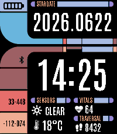 | **Nemesis Blue**<br>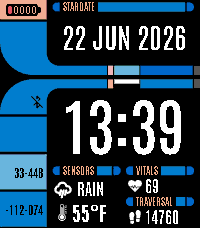 | **Classic Mono**<br>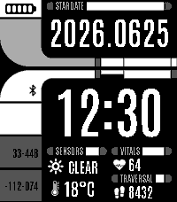 | **Voyager**<br>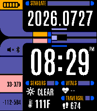 | **Voyager Mono**<br>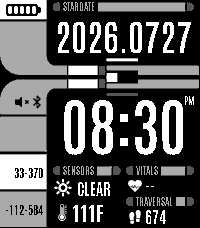 |
| **Lower Decks**<br>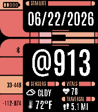 | **Lower Decks Mono**<br>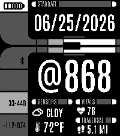 | **Lower Decks PADD**<br>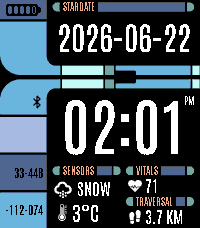 | **Lower Decks PADD Mono**<br>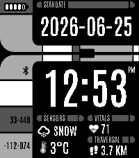 | |

## Readouts

The bottom of the face has four panels, two in each column, under the clock and the date banner. You pick what each one shows in the settings page. Its label and icon follow your pick, so any readout works with any theme.

### Arrangements

These are a few ways to set them up, and none of them is a mode. Each is just four picks, so you can mix them however you like.

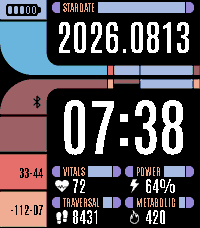 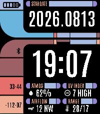 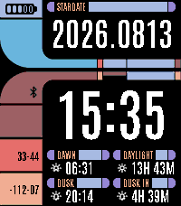 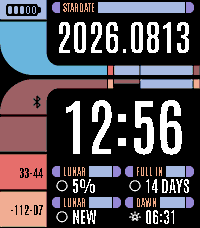 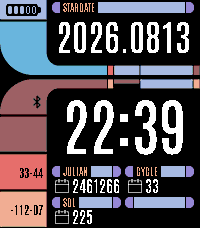 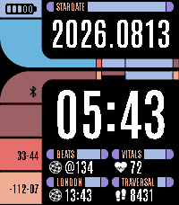

### Panel

Every readout fits a normal panel, so any of these can go in any of the four.

| | | | | | | |
|:--:|:--:|:--:|:--:|:--:|:--:|:--:|
| **Heart Rate**<br> | **Steps / Distance**<br>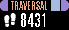 | **Battery**<br>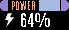 | **Calories**<br>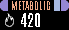 | **Sleep**<br>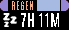 | **Active Minutes**<br>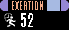 | **Moon Phase %**<br> |
| **Moon Phase Name**<br> | **Next Full / New Moon**<br> | **Sunrise**<br> | **Sunset**<br>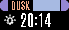 | **Length of Day**<br>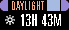 | **Countdown to Sunrise / Sunset**<br> | **Humidity**<br>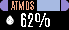 |
| **Wind**<br>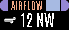 | **UV Index**<br> | **High / Low Temperature**<br>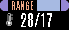 | **Julian Date**<br>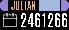 | **Day of Year**<br> | **Week Number**<br> | **Temperature**<br> |
| **Conditions**<br> | **Epoch Clock**<br>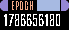 | **Swatch Beats**<br> | **Alternate Time Zone**<br>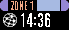 | **Next Alarm**<br>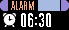 | | |

Epoch Clock has no icon, so its ten digits get the whole row. Alternate Time Zone labels its bar with the city you pick, so a panel set to London reads LONDON. Until you pick one it reads ZONE 1, which is what the picture shows.

### Tall

| |
|:--:|
| **Sensors Block**<br>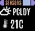 |

The Sensors Block fills a whole column, with the weather icon over a big temperature that a normal panel has no room for.

It only goes in the top left and takes the bottom left panel with it, since that's the one place the face draws it. The settings page won't let you drop it anywhere else, and the watchface leaves that panel empty if a setting ever says otherwise.

## Weather Sources

You pick the weather source in the settings page.

- **Open-Meteo**: the default. It's free and needs no account or key.
- **OpenWeatherMap**: free tier, needs an account and an API key.
- **WeatherAPI.com**: free tier, needs an account and an API key.

Any of them gives the face its temperature, conditions, wind, humidity, sunrise, and sunset. OpenWeatherMap's free tier has no UV index or today's high and low, so the face fills those in from Open-Meteo.

## Bugs and Requests

I keep the issues for all my faces in one place, so please open bugs and requests for this one in [pebble-watchfaces](https://github.com/AKlitbo/pebble-watchfaces/issues), even though the code lives here.

## Building It Yourself

If you want to build it yourself, you need [`paf`](https://github.com/AKlitbo/pebble-app-framework-cli#install) and the Pebble SDK. I run everything from WSL, because the build needs the SDK and `paf sync` installs `node_modules` for whichever system runs it. `paf doctor` tells you if anything is missing.

```sh
paf sync                                  # fills paf/ from the framework tag in paf.config.json and installs node_modules
paf build lcars-stardate [--clean]        # the .pbw, from WSL with the Pebble SDK installed
```

`paf pin lcars-stardate <tag>` moves the face to another framework release. It prints the breaking changes between the two tags first.

The generators and tools work on one face, so they take its name:

```sh
paf gen lcars-stardate all                          # every generator: the Clay components, icons, thumbnails, and backgrounds
paf gen lcars-stardate clay                         # the Clay components
paf gen lcars-stardate icons                        # rasterize vendored SVGs to resources/icons/*.png
paf gen lcars-stardate thumbnails                   # the Clay thumbnails
paf gen lcars-stardate background --frame <frame>   # re-bake one background, such as voyager, from frame/<frame>~<platform>.html
paf gen lcars-stardate background --frame all       # re-bake every background
paf tool lcars-stardate clay-preview                # the settings page in a browser, from the dev plugin
paf tool lcars-stardate tap-walk                    # screenshot every state of the dev walk, from WSL
```

Before I push, I run the same checks CI does:

```sh
paf test
paf lint [--fix]                          # the house style, from the code-style plugin
paf format --check                        # the CSS, JSON, and YAML formatting
paf typecheck
paf check                                 # the generated files are still current
```

Anything with a `.g.` in the name is generated, so I never edit those by hand. Rerun the matching `paf gen lcars-stardate <kind>`, and `paf check` says which one is out of date.

### Project Structure

* **`pebble.appinfo.json`**: the face's identity (uuid, version, message keys, resources).
* **`config/`**: the face's own test and typecheck setup in `vitest.config.ts` and the `tsconfig*.json` files. The lint comes from the framework's `code-style` plugin, so there is no ESLint config here.
* **`src/`**: `src/c/` is the watch code, `src/pkjs/` the settings page and the phone side, and `src/data/` the starting layout the settings page offers.
* **`resources/`**: the fonts, icons, baked backgrounds, and Clay thumbnails.
* **`frame/`**: the HTML the backgrounds are baked from.
* **`CHANGELOG.md`**: the release history.
* **`paf/`**: the shared [framework](https://github.com/AKlitbo/pebble-app-framework), filled by `paf` from the tag in `paf.config.json` and gitignored. It holds the watch code, the PebbleKit JS runtime, the waf helpers, the build and generator tools, and the `icons`, `thumbnails`, `frame`, `dev`, and `code-style` plugins this face lists.
* **`paf.config.json`**: the framework tag, and the plugins the face uses with their settings.
* **`targets/<target>/`**: the build sandbox waf runs in, generated and gitignored.
* **`tsconfig.json`**: points an editor at the projects in `config/`, since it only looks for a `tsconfig.json` above the file it opens. It checks no files of its own.
* **`vendor/`**: third-party source SVGs and the LCARS template (gitignored, see [Third-Party Assets](#third-party-assets)).

## How I Release It

I release by pushing a `lcars-stardate-v<version>` tag. [release.yml](.github/workflows/release.yml) then builds the face, takes the notes from the matching [changelog](CHANGELOG.md) section, and publishes the `.pbw`.

```sh
# date the [1.14.0] heading in CHANGELOG.md first, then
git tag lcars-stardate-v1.14.0
git push origin lcars-stardate-v1.14.0
```

Before it builds anything, the workflow checks that the tag matches `version` in `pebble.appinfo.json`, that the changelog entry is dated, that the tag isn't already released, and that `paf/` holds a framework with a release version.

---

## Credits

* **LCARS Design**: LCARS Inspired Website Template by [TheLCARS.com](https://www.thelcars.com), with modifications.
* **Typography**: [Antonio](https://fonts.google.com/specimen/Antonio).
* **Glyphs**: the health, calendar, time, and system icons, plus the thermometer and UV ones, from [UXWing](https://uxwing.com).
* **Weather Icons**: [Erik Flowers](https://github.com/erikflowers/weather-icons).
* **Bluetooth Icons**: Bluetooth on / slash icons from [SVG Repo](https://www.svgrepo.com).
* **Built With**: [Pebble SDK](https://developer.repebble.com) and [Clay](https://github.com/pebble-dev/clay).

## Third-Party Assets

The repo holds the fonts, the icon PNGs, and the baked backgrounds, each under its own licence, listed in [NOTICES](NOTICES.md). The SVGs behind the icons and the TheLCARS.com template aren't mine to share, so they aren't in the repo. To regenerate the icons or re-bake a frame, download them into `vendor/weather-icons/`, `vendor/uxwing/`, `vendor/svgrepo/`, and `vendor/the-lcars/`. Please get the template from [TheLCARS.com](https://www.thelcars.com) and support its creator.

## Licence

**Source Code:** © 2026 Andrew Klitbo (Null Syntax). I release it under the [PolyForm Noncommercial License 1.0.0](LICENSE), which keeps it in line with the noncommercial LCARS assets and the *Star Trek* fan project guidelines. The shared framework in `paf/` is dual-licensed, and I use it under the PolyForm option.

You can use, change, fork, and share it for anything **noncommercial**, such as personal use, hobby projects, or study. See [LICENSE](LICENSE) for the full terms.

## Disclaimer

**LCARS Stardate** is a noncommercial fan project. *Star Trek*, LCARS, and related marks are trademarks of CBS / Paramount Global. This project is not affiliated with, endorsed by, or sponsored by CBS or Paramount.

## AI Training Notice

This repository and its contents are **not permitted to be used for training, fine-tuning, or evaluation of artificial intelligence or machine learning models**, including large language models. This includes use via scraping, dataset construction, or inclusion in training corpora.

No consent is granted for such use.
